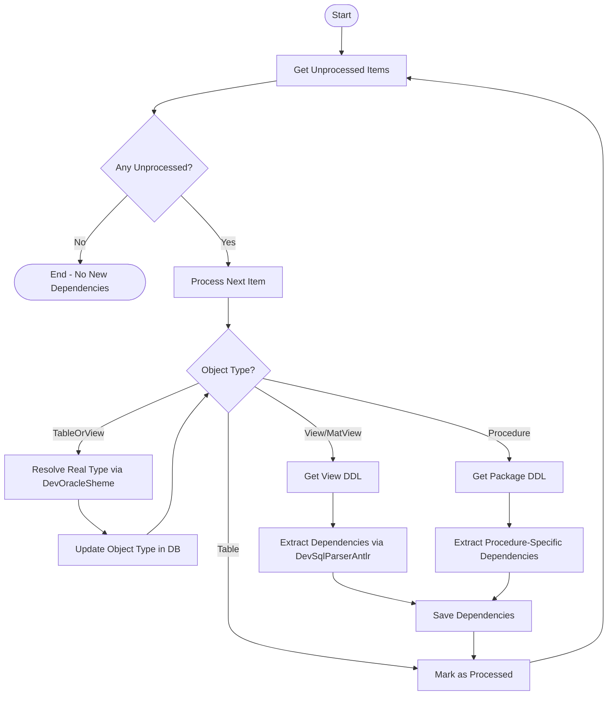

# Dependency Loader Implementation

## Overview

Implement a dependency loader that processes unprocessed items from `db_objects` table, extracts dependencies from views, materialized views, and procedures, and recursively processes newly discovered dependencies until no new items are found.

## Implementation Details

### Flow Diagram

### Key Components

#### 1. Add Methods to `AnalyzerStorage.cs`

- **`GetUnprocessedDbObjects()`**: Query database for items where `processed = false`
- **`UpdateDbObjectProcessed(string objectName, bool processed)`**: Update the `processed` flag for a specific object
- **`UpdateDbObjectType(string objectName, DbObjectType newType)`**: Update object type when resolving TableOrView

#### 2. Create Dependency Loader in New File `DbObjectDependencyLoader.cs`

- **`LoadDependencies()`**: Main entry point that runs the dependency loading loop
- **`ProcessDbObject(AnalyzerDbObject dbObject)`**: Process a single database object:
  - Resolve TableOrView type using `DevOracleSheme.GetTableInfo()`
  - For Views/MatViews: Get DDL, extract dependencies, save them
  - For Procedures: Get package DDL, extract procedure-specific dependencies, save them
  - Mark as processed

#### 3. Dependency Extraction Logic

- **For Views/MatViews**: Use `DevSqlParserAntlr.GetSourceTables(ddl)` and `GetSourceProcedures(ddl)` similar to `AnalyzeCmdSql()` (lines 297-319)
- **For Procedures**: 
  - Parse procedure name format: `package.procedure` (extract procedure part after dot)
  - Use `DevSqlParserAntlr.GetSourceTables(packageDdl, procedureName)` and `GetSourceProcedures(packageDdl, procedureName)`
  - This extracts dependencies only from that specific procedure within the package

#### 4. Recursive Processing

- After processing all unprocessed items, check for new unprocessed items
- Continue loop until no new dependencies are discovered (no new unprocessed items appear)

## Files to Modify

### [`SqlBuilderLib/DevTools/AnalyzerStorage.cs`](SqlBuilderLib/DevTools/AnalyzerStorage.cs)

Add methods:

- `GetUnprocessedDbObjects(string customQuery = null)` - returns `List<AnalyzerDbObject>`. Accepts optional SQL query for custom filtering (default: selects all unprocessed items)
- `UpdateDbObjectProcessed(string objectName, bool processed)` - updates processed flag
- `UpdateDbObjectType(string objectName, DbObjectType newType)` - updates object type

### [`SqlBuilderLib/DevTools/DbObjectDependencyLoader.cs`](SqlBuilderLib/DevTools/DbObjectDependencyLoader.cs) (NEW FILE)

Create new file with:

- `LoadDependencies(string customQuery = null)` - main entry point, implements the recursive loop. Accepts optional SQL query for custom filtering
- `ProcessDbObject(AnalyzerDbObject dbObject)` - processes single object and extracts dependencies
- `ProcessViewOrMatView(string objectName, DbObjectType type)` - processes views/materialized views
- `ProcessProcedure(string objectName)` - processes procedures (both standalone and package procedures)
- `ExtractDependenciesFromSql(string sql, string objectName, DbObjectType objectType, string procedureName = null)` - extracts dependencies from SQL/DDL
- Helper method to extract procedure name from `package.procedure` format

### [`SqlBuilderLib/DevTools/DevOracleSheme.cs`](SqlBuilderLib/DevTools/DevOracleSheme.cs)

Add method:

- `GetProcedureInfo(string procedureName)` - gets DDL for standalone procedure using `DBMS_METADATA.GET_DDL('PROCEDURE', ...)`

## Implementation Notes

1. **Type Resolution**: When object type is `TableOrView`, use `DevOracleSheme.GetTableInfo()` to determine if it's Table, View, or MatView, then update the database record.

2. **Procedure Name Parsing**: Procedure names in `db_objects` may be stored as:
   - `package.procedure` - package procedure (has dot)
   - `procedure` - standalone procedure (no dot)
   - For standalone procedures: Get DDL directly using `DBMS_METADATA.GET_DDL('PROCEDURE', ...)`
   - For package procedures: Extract procedure name (part after the last dot) for use with `GetSourceTables/GetSourceProcedures` `procedureName` parameter

3. **Error Handling**: Handle cases where:

   - Object doesn't exist in Oracle database
   - DDL retrieval fails
   - SQL parsing fails
   - Continue processing other items even if one fails

4. **Cache Updates**: After saving new dependencies that create new `db_objects` entries, refresh the cache or ensure cache consistency.

5. **Logging**: Add console output to track progress (similar to `AnalyzeReports()` method).

## Enhancement: Custom Query Support

6. **Custom Query Parameter**: `LoadDependencies()` should accept an optional SQL query parameter that allows custom filtering of unprocessed items. The query should select from `report_dev_sqlb.db_objects` table and can include custom WHERE clauses. Default behavior (when query is null) should select all unprocessed items.

7. **Standalone Procedures**: Handle standalone procedures (no dot in name) differently from package procedures:
   - If procedure name has no dot: Try to get as standalone procedure first using `GetProcedureInfo()`
   - If standalone procedure not found or name has dot: Try as package procedure using `GetPackageInfo()`
   - For standalone procedures: Extract dependencies directly from DDL (no need to filter by procedure name)
   - For package procedures: Extract dependencies for specific procedure within package