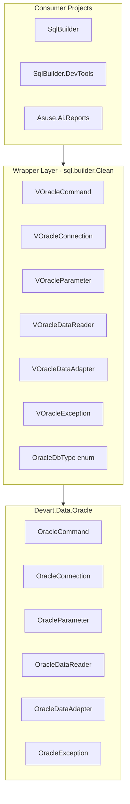

# Devart Dependency Consolidation Plan

## Summary

Refactor the SqlBuilder solution to isolate Devart.Data.Oracle usage in a single wrapper layer. Create thin wrapper classes (no new logic) and replace all usages so that `using Devart.Data.Oracle` appears only in wrapper files.

## Scope

**In scope:**

- [SqlBuilder](C:\Repos\github\sql-builder-web\net\SqlBuilder) project
- [SqlBuilder.DevTools](C:\Repos\github\sql-builder-web\net\SqlBuilder.DevTools) project  
- [Asuse.Ai.Reports](C:\Repos\github\sql-builder-web\net\Asuse.Ai.Reports) project (uses SqlBuilder transitively)

**Out of scope:**

- [SqlBuilder.Sandbox](C:\Repos\github\sql-builder-web\net\SqlBuilder.Sandbox) - uses `Oracle.ManagedDataAccess.Client` (different provider)
- Generated code strings in [CodeGenerationUtils.cs](C:\Repos\github\sql-builder-web\net\SqlBuilder\XmlHelpers\CodeGenerationUtils.cs) and [CodeGenerationUtils.LKK.cs](C:\Repos\github\sql-builder-web\net\SqlBuilder\XmlHelpers\CodeGenerationUtils.LKK.cs) - these emit `Devart.Data.Oracle` in output; can be updated separately to emit wrapper type names if desired

---

## Devart Types Inventory


| Devart Type                   | Wrapper Strategy                                                                                            | Used In                                                      |
| ----------------------------- | ----------------------------------------------------------------------------------------------------------- | ------------------------------------------------------------ |
| **OracleCommand**             | Already exists: [VOracleCommand.cs](C:\Repos\github\sql-builder-web\net\SqlBuilder\Clean\VOracleCommand.cs) | Cmn, DataHelper, VDBSelectCommand, XmlReports, etc.          |
| **OracleConnection**          | Inheritance: `VOracleConnection : OracleConnection`                                                         | db, CleanSqlBuilder, SqlBuilderService, Global, DataHelper   |
| **OracleParameter**           | Inheritance: `VOracleParameter : OracleParameter`                                                           | db, DevOracleSheme, DataHelper, VDBSelectCommand             |
| **OracleParameterCollection** | Inheritance: `VOracleParameterCollection : OracleParameterCollection`                                       | Cmn.TryGetParameter extension, Parameters property           |
| **OracleTransaction**         | Inheritance: `VOracleTransaction : OracleTransaction`                                                       | VOracleCommand constructors                                  |
| **OracleDataReader**          | Composition (no public ctor): wrap and delegate                                                             | VDataTable, TableReference, DataHelper, VDataTable.Transpose |
| **OracleDataAdapter**         | Inheritance: `VOracleDataAdapter : OracleDataAdapter`                                                       | VDataTable, XmlReports (indirect)                            |
| **OracleException**           | Inheritance: `VOracleException : OracleException`                                                           | ArrayStorage, DataHelper, CustomOracleError                  |
| **OracleDbType**              | Own enum with same values (mirror Devart)                                                                   | Cmn.GetDBType, db, VDBSelectCommand, SqlArg, DataHelper      |
| **OracleObjectType**          | Own enum (used in DataHelper.OracleSqlException)                                                            | DataHelper custom OracleError                                |


---

## Architecture




---

## Implementation Plan

### Phase 1: Create Wrapper Types

Create all wrappers in a dedicated folder: `SqlBuilder/Clean/Oracle/` (or keep in `SqlBuilder/Clean/` alongside existing VOracleCommand).

**1.1 Simple inheritance wrappers (thin, no logic):**

- **VOracleConnection** - same pattern as VOracleCommand, all constructors delegate to base
- **VOracleParameter** - wrap all constructors used in codebase (string, OracleDbType, object, ParameterDirection; string, OracleDbType; etc.)
- **VOracleParameterCollection** - empty inheritance (for extension method signature)
- **VOracleTransaction** - empty inheritance
- **VOracleDataAdapter** - empty inheritance  
- **VOracleException** - empty inheritance (for catch blocks and `ex.Code`)

**1.2 OracleDbType enum:**

Create `OracleDbType` in wrapper namespace with values matching Devart (Number, VarChar, Date, Clob, Blob, NClob, NVarChar, Array, IntervalDS, etc.). Used in: Cmn.GetDBType, db.cs, VDBSelectCommand, SqlArg, DataHelper.

**1.3 OracleDataReader (composition):**

`OracleDataReader` has no public constructor; it is created by `ExecuteReader()`. Use composition:

- `VOracleDataReader` holds `OracleDataReader _inner`
- Constructor: `VOracleDataReader(OracleDataReader inner)`
- Delegate all `DbDataReader`/indexer members to `_inner`
- Override `ExecuteReader` in VOracleCommand to return `new VOracleDataReader(base.ExecuteReader() as OracleDataReader)` - or add extension/factory in wrapper layer

Actually: `ExecuteReader()` returns `DbDataReader`; the concrete type is `OracleDataReader`. We cannot change the return type of `OracleCommand.ExecuteReader`. So callers will receive `OracleDataReader` from `cmd.ExecuteReader()`. Options:

- **Option A:** Add `VOracleCommand.ExecuteReader()` that returns `VOracleDataReader` (new method, not override) - but `ExecuteReader` is not virtual in a way we can change return type.
- **Option B:** Factory method `VOracleDataReader.Wrap(cmd.ExecuteReader())` - callers use this.
- **Option C:** Keep `OracleDataReader` in a few places - violates goal.

**Recommended:** Add `VOracleCommand.ExecuteReaderWrapped()` that returns `VOracleDataReader`, and update all call sites to use it. Alternatively, use `new VOracleDataReader((OracleDataReader)cmd.ExecuteReader())` at each call site.

**1.4 OracleObjectType enum:**

DataHelper defines custom `OracleError`/`OracleErrorCollection` that use `OracleObjectType.Unknown`. Create wrapper enum with at least `Unknown` and any other values used.

---

### Phase 2: Update VOracleCommand

- Change constructor parameters from `OracleConnection`/`OracleTransaction` to `VOracleConnection`/`VOracleTransaction` (or keep base types for compatibility - base constructors require Devart types, so we pass `connection` which could be VOracleConnection since it inherits).
- Add `ExecuteReaderWrapped()` if we use the factory approach for VOracleDataReader.

---

### Phase 3: Replace Usages

**Files to update (remove `using Devart.Data.Oracle`, use wrappers):**


| File                                                                                                                  | Changes                                                                     |
| --------------------------------------------------------------------------------------------------------------------- | --------------------------------------------------------------------------- |
| [Cmn.cs](C:\Repos\github\sql-builder-web\net\SqlBuilder\Cmn.cs)                                                       | GetDBType return type, TryGetParameter params, ExtractParameterNamesFromSQL |
| [db.cs](C:\Repos\github\sql-builder-web\net\SqlBuilder\db.cs)                                                         | OracleConnection, OracleParameter, OracleDbType                             |
| [CleanSqlBuilder.cs](C:\Repos\github\sql-builder-web\net\SqlBuilder\Clean\CleanSqlBuilder.cs)                         | OracleConnection                                                            |
| [DataHelper.cs](C:\Repos\github\sql-builder-web\net\SqlBuilder\Clean\DataHelper.cs)                                   | OracleParameter, OracleConnection, OracleException, OracleDataReader        |
| [Global.cs](C:\Repos\github\sql-builder-web\net\SqlBuilder\Clean\Global.cs)                                           | OracleConnection                                                            |
| [VDBSelectCommand.cs](C:\Repos\github\sql-builder-web\net\SqlBuilder\DataApi\DataObjects\VDBSelectCommand.cs)         | OracleCommand, OracleParameter, OracleDbType                                |
| [VDataTable.cs](C:\Repos\github\sql-builder-web\net\SqlBuilder\DataApi\DataObjects\VDataTable.cs)                     | OracleDataReader                                                            |
| [VDataTable.Transpose.cs](C:\Repos\github\sql-builder-web\net\SqlBuilder\DataApi\DataObjects\VDataTable.Transpose.cs) | OracleDataReader in method params                                           |
| [TableReferense.cs](C:\Repos\github\sql-builder-web\net\SqlBuilder\Print\TableReferense.cs)                           | OracleDataReader                                                            |
| [CustomOracleError.cs](C:\Repos\github\sql-builder-web\net\SqlBuilder\DataApi\DataObjects\CustomOracleError.cs)       | OracleException                                                             |
| [ArrayStorage.cs](C:\Repos\github\sql-builder-web\net\SqlBuilder\Core\ArrayStorage.cs)                                | OracleException                                                             |
| [XmlReports.cs](C:\Repos\github\sql-builder-web\net\SqlBuilder\Core\XmlReports.cs)                                    | Various Oracle types                                                        |
| Plus ~25 more files                                                                                                   | Per grep results                                                            |


**SqlBuilder.DevTools:**

- [DevAnalyzer.cs](C:\Repos\github\sql-builder-web\net\SqlBuilder.DevTools\DevAnalyzer.cs)
- [DevOracleSheme.cs](C:\Repos\github\sql-builder-web\net\SqlBuilder.DevTools\DevOracleSheme.cs)

**Asuse.Ai.Reports:**

- [SqlBuilderService.cs](C:\Repos\github\sql-builder-web\net\Asuse.Ai.Reports\Services\SqlBuilderService.cs) - uses OracleConnection

---

### Phase 4: Package References

- **SqlBuilder**: Keep Devart package reference (wrappers need it).
- **SqlBuilder.DevTools**: Remove Devart package reference; use types from SqlBuilder.
- **Asuse.Ai.Reports**: No direct Devart reference (already transitive via SqlBuilder).

---

## Special Cases

1. **SqlArg** (in infoenergo.core / db.cs): Uses `OracleDbType.NClob`. Replace with wrapper enum.
2. **DataHelper.OracleSqlException**: Uses custom OracleError/OracleErrorCollection with `OracleObjectType`. Add wrapper enum for OracleObjectType.
3. **VOracleCommand constructors**: Already take `OracleConnection`/`OracleTransaction`; change to `VOracleConnection`/`VOracleTransaction` (inheritance allows passing).
4. **CodeGenerationUtils**: Generated strings contain `Devart.Data.Oracle.OracleCommand`. Optional: update to use wrapper names in generated code.
5. **OracleIntervalDS**: Only in comment (db.cs line 263). No change needed.

---

## Wrapper File Layout

```
SqlBuilder/Clean/
  VOracleCommand.cs      (existing, update to use VOracleConnection/VOracleTransaction)
  VOracleConnection.cs
  VOracleParameter.cs
  VOracleParameterCollection.cs
  VOracleTransaction.cs
  VOracleDataReader.cs
  VOracleDataAdapter.cs
  VOracleException.cs
  OracleDbType.cs        (enum)
  OracleObjectType.cs    (enum, if needed)
```

---

## Verification

- Build succeeds for SqlBuilder, SqlBuilder.DevTools, Asuse.Ai.Reports
- `grep -r "using Devart" --include="*.cs"` returns only wrapper files
- No functional changes; existing tests pass

