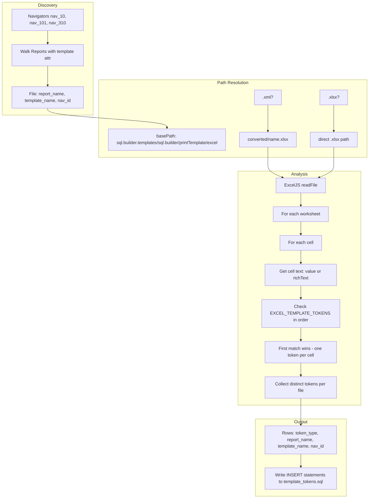

# Excel Template Token Analyzer Plan

## Overview

Standalone ad-hoc script in [analyze-excel-templates.ts](C:\Repos\ai\asuse-ai\asuse-ai-reports\ad-hoc\analyze-excel-templates.ts) that:

1. Discovers Excel template files from navigators (reports with templates)
2. Opens each file with exceljs 4.4.0
3. Walks all sheets and cells, detecting tokens in EXCEL_TEMPLATE_TOKENS order (first match per cell)
4. Collects distinct tokens per file
5. Writes SQL INSERT statements to [template_tokens.sql](C:\Repos\github\sql-builder-web\net\SqlBuilder.DevTools\Sql\template_tokens.sql)

## Data Flow




## Key Implementation Details

### 1. Template Path Resolution

Base path: `C:/Repos/ai-tfs/root/main/all/sql.builder.templates/sql.builder/printTemplate/excel`

- **.xlsx files**: use `path.join(basePath, templateName)` directly
- **.xml files**: use `path.join(basePath, 'converted', path.parse(templateName).name + '.xlsx')` (converted SpreadsheetML)

### 2. Token Detection Logic

From [analyze-excel-templates.ts](C:\Repos\ai\asuse-ai\asuse-ai-reports\ad-hoc\analyze-excel-templates.ts) lines 14-30:

```ts
const EXCEL_TEMPLATE_TOKENS = [
  '[merge_down]', '[merge_start]', '[merge_right]', 'headmarker',
  '!deleterow', '!delete', '!columnwidth', '!rowheight', ...
] as const;
```

- For each cell: get text from `cell.value` (string) or `cell.text` (rich text) or `cell.value?.richText` (array of `{text}`)
- Check tokens **in order** (first match wins)
- Each cell contributes at most one token
- Aggregate distinct tokens per file

### 3. ExcelJS Cell Reading

- Use `workbook.xlsx.readFile(path)` to load
- Iterate: `workbook.worksheets` → `sheet.eachRow()` or `sheet.getRow(i)` → `row.eachCell()` → `cell`
- Cell text: `typeof cell.value === 'string' ? cell.value : (cell.value?.richText?.map(p => p.text).join('') ?? '')`

### 4. Output Schema

Table: `report_dev_sqlb.template_tokens`


| Column        | Type |
| ------------- | ---- |
| token_type    | text |
| report_name   | text |
| template_name | text |
| nav_id        | text |


One row per (token, report, template, nav) - same template used by multiple reports yields multiple rows per token.

### 5. SQL Output Format

Append to `template_tokens.sql` (or replace existing content):

```sql
-- Generated by analyze-excel-templates.ts
DELETE FROM report_dev_sqlb.template_tokens;
INSERT INTO report_dev_sqlb.template_tokens (token_type, report_name, template_name, nav_id) VALUES
('merge_down', 'asuse2.10653(38)-new', '10653(38)-7-new.xml', '10'),
...
```

Escape single quotes in values (e.g. `'` → `''`).

## Files to Modify


| File                                                                                                                               | Action                                 |
| ---------------------------------------------------------------------------------------------------------------------------------- | -------------------------------------- |
| [asuse-ai-reports/ad-hoc/analyze-excel-templates.ts](C:\Repos\ai\asuse-ai\asuse-ai-reports\ad-hoc\analyze-excel-templates.ts)      | Rewrite as standalone script           |
| [net/SqlBuilder.DevTools/Sql/template_tokens.sql](C:\Repos\github\sql-builder-web\net\SqlBuilder.DevTools\Sql\template_tokens.sql) | Output target (script writes SQL here) |


## Run Strategy

- Script runs via `npx ts-node` or `npm run` from asuse-ai-reports (exceljs already in package.json)
- Uses existing navigators: nav_10, nav_101, nav_310
- No database connection required (writes SQL file only; connection string provided for reference but not used by script)

## Edge Cases

- **Missing template file**: Skip with warning, continue
- **Empty cells**: Skip (no text)
- **Cell with formula**: Use `cell.value` or `cell.text` per ExcelJS API
- **Rich text**: Concatenate all `richText[].text` parts
- **Same template, multiple reports**: One row per (token, report, template, nav) combination

